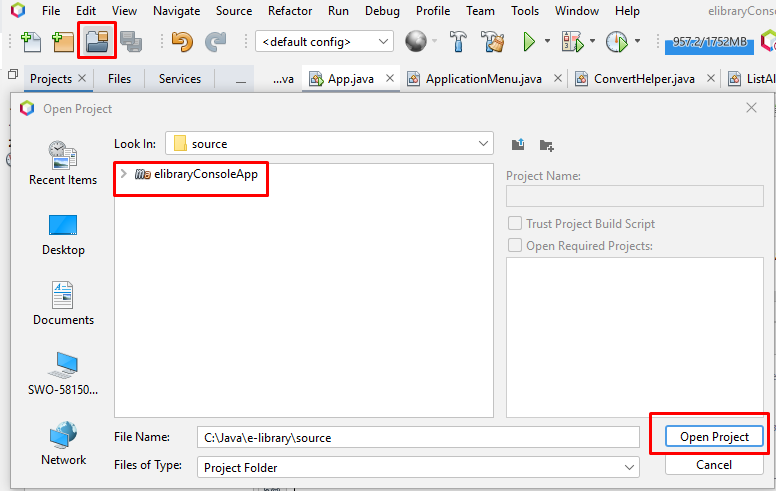
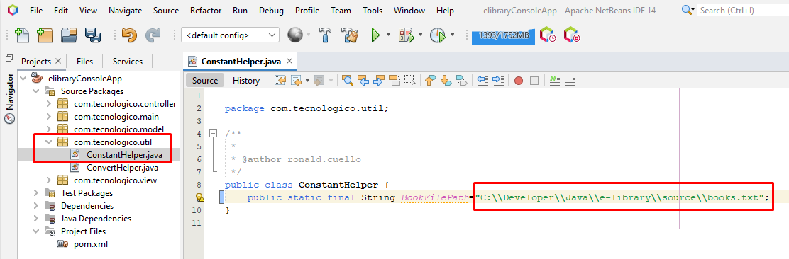
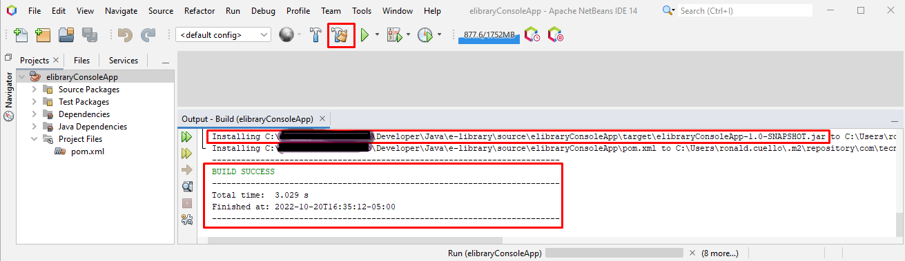
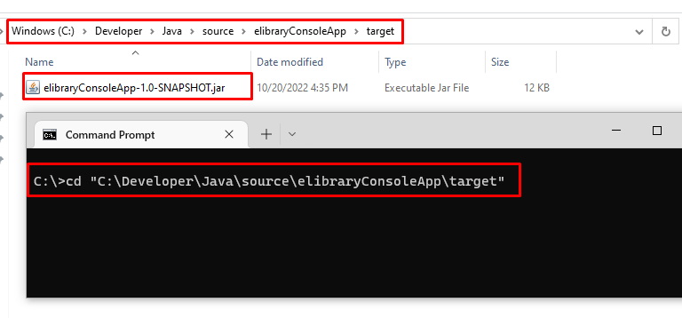
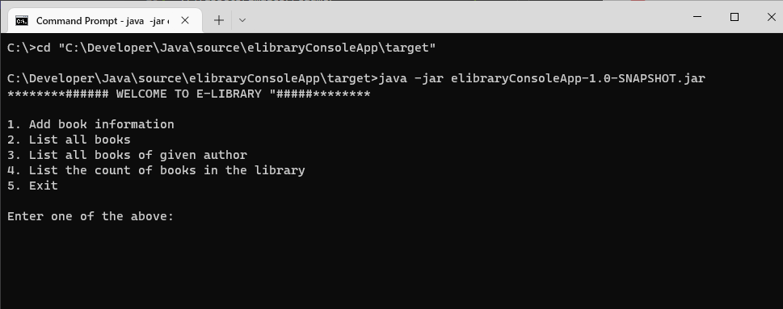

# E -Library Management System
En este proyecto, discutiremos el enfoque para crear un sistema de administración de bibliotecas electrónicas donde el usuario tiene las siguientes opciones:

1. Add book information
2. List all books 
3. List all books of given author           
4. List the count of books in the library  
5. Exit  

El proyecto hace uso de archivos para cargar los libros, para modificar la ruta de lectura del archivo debe modificar la clase ConstantHelper:

```java
public class ConstantHelper {
    public static final String BookFilePath="C:\\source\\books.txt";
}
```  

## Prerequisitos
- [Iconos Markdown](https://github-emoji-picker.vercel.app/)
- [Java SDK](https://www.oracle.com/java/technologies/downloads/#jdk19-windows): jdk19-windows
- [NetBeans IDE](https://netbeans.apache.org/download/index.html)
- [PlantUML](https://plantuml.com/es/) diagramas uml
- [Maven](https://maven.apache.org/download.cgi) Para Compilar y generar artefactos de ejecucion del proyecto
  - [Instalar manualmente Maven en Windows 10](https://dev.to/vanessa_corredor/instalar-manualmente-maven-en-windows-10-50pb) Tutorial para instalar Maven en windows 10

##  :hammer_and_wrench: Compilar proyecto (Netbeans)
1. Descarga el proyecto del repositorio de Github
1. Abre netbeans
1. En netbeans, en la barra de comandos presiona "Open Project" y agrega el proyecto.

1. Modifica la clase **ConstantHelper.java** con la ruta del archivo de texto

1. En la barra de comandos, presiona el boton "Clean and Build project"

1. Al realizar estas acciones se generará un archivo llamado **elibraryConsoleApp-1.0-SNAPSHOT.jar** que será nuestro ejecutable para la aplicación.
1. Este archivo es necesario para ejecutar la aplicación por la consola del sistema operativo.

## :hammer_and_wrench: Compilar proyecto (Maven)
1. Para compilar y generar el archivo ejecutable **jar** del proyecto, primero debes tener configurado este tutorial en tu maquina [Instalar manualmente Maven en Windows 10](https://dev.to/vanessa_corredor/instalar-manualmente-maven-en-windows-10-50pb)
2. Ejecuta el siguiente comando
```console
C:\Developer\Java\source\elibraryConsoleApp\> mvn clean install 
``` 


3. Al realizar estas acciones se generará un archivo llamado **elibraryConsoleApp-1.0-SNAPSHOT.jar** que será nuestro ejecutable para la aplicación.

4. Este archivo es necesario para ejecutar la aplicación por la consola del sistema operativo.

## :atom: Ejecutar aplicación (Windows)
1. Desde la consola (CMD) de windows dirigete a la ubicación del archivo **elibraryConsoleApp-1.0-SNAPSHOT.jar**

2. Ejecuta el siguiente comando
```console
C:\Developer\Java\source\elibraryConsoleApp\target> java -jar elibraryConsoleApp-1.0-SNAPSHOT.jar 
```
3. Esto deberia ejecutar la aplicación desde la consola de windows.

4. Have fun 😊
